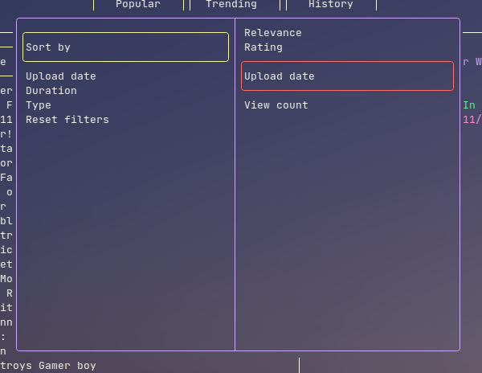
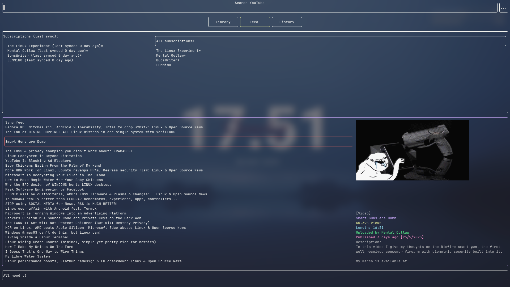

# Basic usage

Here is a basic how-to guide on the TUI.

## Cursor

The *cursor* can be moved using arrow keys, or Vim keybindings (hjkl).

The item with the cursor hovering will have a <u>red outline</u>.

> Everything here refers to the *latest default config*, including the keybindings.

|Function|Key(s)|
|---|---|
|Select|Enter|
|Deselect|Esc|
|Cursor up|Up arrow / `k`|
|Cursor down|Down arrow / `j`|
|Cursor left|Left arrow / `h`|
|Cursor right|Right arrow / `l`|
|Previous page|Backspace / Alt + Left arrow|
|First page history|Home|
|Clear page history|End|
|Paste from clipboard|`Ctrl` + `V`|
|Next/previous entry on search and command|`Ctrl` + up/down arrow|
|Next song|`Ctrl` + `Shift` + Right arrow|
|Seek audio|`Ctrl` + left/right arrow|
|Pause/resume audio|Space|
|Enter command mode|`:`|
|Quit|`q`|

## Selection

Selecting an item allows you to move the cursor within that item, to select an item, press `Enter`.

When nothing is selected, you can move the cursor between items, to deselect from an item, hit `Esc`.

## Searching

Type the search query when the search bar and press `Enter`, use arrow keys to move the cursor around.

To apply search filters, select the button with 3 dots (`...`) to the right of the search bar, hit enter to start modifying and enter again to save. Pressing `Esc` should reload the current search page to apply the filters.

> You may use `Ctrl + Up/Down arrow` to cycle through previously searched queries (when focused on the search bar).

## Playing media with embedded player

By default, running any "play video" options in video or playlist view will open a new mpv player window.

While any "play audio" options will start playing the audio in the embedded audio player,

- seek and rewind using `Ctrl + Left/Right arrow`
- skip with `Ctrl + Shift + Right arrow`
- pause and resume with space

## Playing videos and playlists externally

You can also play audio and videos externally.

> This part assumes that you use `mpv` as your video player, `konsole` as your terminal emulator, `yt-dlp` as your YouTube video downloader, and `firefox` as your browser.
> 
> If that is not the case, you can learn how to change that in the *custom commands* section.

You can press keybindings like `Shift` + `A` to run a command which opens a new terminal screen, and in that terminal screen it runs an mpv command to play the media.

## Feeds

Feeds allows you to view updates from subscribed channels, similar to how subscriptions works on YouTube.

## Command mode

Command mode is like that of Vim, it can be started by pressing `:` when nothing is selected.

More about commands in the [next chapter](commands.md).

## Command bindings

Keys can be bind to a command, more about it in the next chapter.

For example `Ctrl + F` launches your web browser.

## Buttons

Buttons are similar to hyperlinks, it allows you to navigate between pages.

## Mouse click control

Mouse click controls has been added, you can now use your mouse to navigate around the TUI. Here are the general rules:

1. Clicking an item *moves the cursor* to that item, clicking again *selects* the item
2. Clicking on buttons, or items on a list has the same effect as pressing `Enter` on them
3. Clicking outside a popup closes the popup

However, there are some downsides to not using your keyboard.

1. Cannot move up or down to items not on screen in a list (you can do that with `Up` or `Down arrow`)
2. Cannot access function keys like `Backspace` or `Q`

## Library

Items can be bookmarked and saved to library, they can also be saved to be viewed offline.
