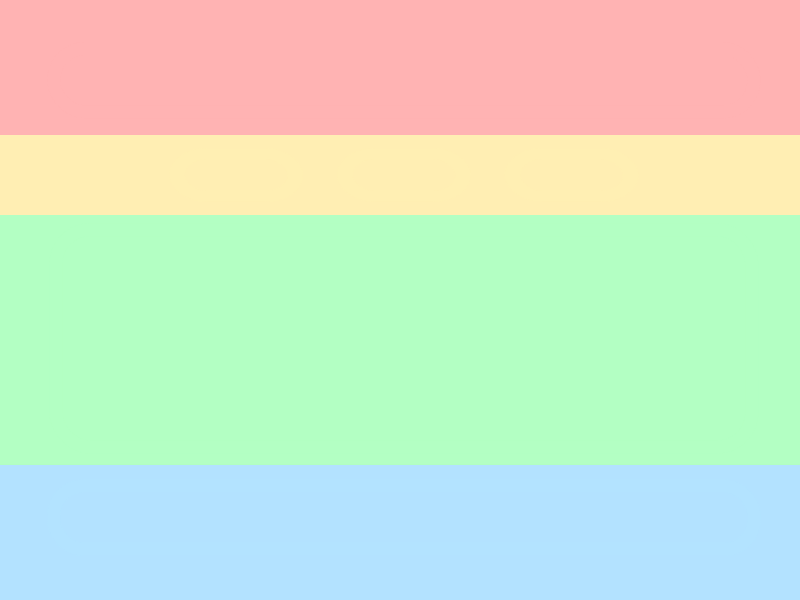

# Framework

At the core of this TUI, is the framework from the <a href="https://crates.io/crates/tui-additions" target=_blank>`tui-additions`</a> crate, it allows the program to *render* onto the screen, *take inputs* (mouse and keyboard) in an orderly fashion.

A <a href="https://docs.rs/tui-additions/latest/tui_additions/framework/struct.Framework.html" target=_blank>Framework</a> holds a bunch of other structs, a simplified version would looks something like this.

```rs
struct Framework {
	state: Vec<Vec<Item>>,
	cursor: CursorState,
	selectables: Vec<Vec<(usize, usize)>>,
	data: FrameworkData,
	history: FrameworkHistory,
}
```

## State

Holds a 2D array of items, but that is just the simplified version.

The `State` struct also holds the width of the items, heigh of the rows, and other details such as *if the row should be centered or not*.

## Cursor

The cursor can be in one of these states.

- Selected - where an item is selected.
- Hover - when its being moved around.
- None - when the page first loads, the cursor does not have a state.

## Selectables

This is an interesting one. As [mentioned below](#selectableself---bool), some items can be hovered when other cannot. Each `selectables[x][y]` maps to a selectable (hoverable) coordinate.

Instead of using a `HashMap<(usize, usize)>`, using a 2D array ensures that all *x: 0..range* and *y: 0..range* are mapped to a selectable item. And moving the cursor left is as easy as increasing x by 1, without having to worry about selectability check and stuff.

## Data

There are 2 pools of data available - *global* and *state*.

**Global data** are global across all pages, this is mainly used to store config structs, as they are meant to be applied globally.

**State data** are exclusive to each page, this is done to ensure that each page will get the correct data. 

> For example, if state data is not used, the next page will overwrite data in the previous page, making going back in history impossible.

[This](https://github.com/Siriusmart/tui-additions/blob/3087abbf8e121f26c0956cda5fb43efc7b862bc7/src/framework/framework.rs#LL39C4-L39C4) showed how state data stays with the history *snapshot* of the page, whereas global data does not.

## History

This stores the past states and data of the struct, pretty self explanatory.

<hr>

## Items

Items are placed across the screen *in rows*, each item is <u>individual</u> and changing of one should not affect others in anyway.



> Diagram showing that individual items arranged in rows on screen.

Each item has a set of functions from the trait <a href="https://docs.rs/tui-additions/latest/tui_additions/framework/trait.FrameworkItem.html" target=_blank>FrameworkItem</a>:

### .selectable(&self) -> bool

The function is ran on page load, it determines whether *the item can be hovered by cursor or not*.

Most item returns true, as they can be selected and hovered.

However there are some exceptions, including MessageBar and the big info display in channel home page.

> PageButtons returns true in this function, as they can be hovered by cursor. Instead, `.select()` is responsible for their special behaviour.

### .select(&mut self, &mut Framework) -> bool

This function is ran when an item is selected (pressed enter on), it allows the item to modify its own state and the framework state. The returned boolean also determines if the selecting item will *stay selected* and capture key input.

Most items returns true in this function, for example SearchBar stays selected and captures key input after being selected, until deselect.

PageButtons returns false, as they don't want to say selected. This does not mean the function does nothing, they are still able to modify their own states and <u>push a LoadPage task to queue</u>.

### .deselect(&mut self, &mut Framework) -> bool

This function is the exact opposite  of the .select() function, it is called when the *deselect keybinding* (Esc) is pressed, or the mouse clicks somewhere outside the item.

All items returns true on this function.

> A fun fact is that items can actually return false, and refuse to get deselected. This can be useful when waiting for a condition to be met.

### .load_item(&mut self, &mut Framework, ...) -> Result

This is the function responsible for the loading of items. The YouTube TUI adds an empty item to the screen, then calls this function for the item to load itself.

An item that heavily rely on this function is ItemList, it loads video according to the current page, whether it's Library, History or Search.

> Currently, this function can be very inefficient as items are loaded one after another (sync). This will improve once Rust implements async traits.

Errors will be displayed in MessageBar in the next frame.

### .render(&mut self, &mut Framework, &mut Frame, area)

Items should be able to render itself within `area` of `Frame`, the area is different for each item, and should not overlap.

Each frame is rendered 2 times.

1. Render all normal items.
2. Render all popups, as they need to be above normal items.

Normal items should not render in the popup render, for example:

```rs
if popup_render {
	return;
}
```

### .key_event(&mut self, &mut Framework, KeyEvent) -> Result

Pretty self explanatory, selected item takes in a key event and do some modification to itself and/or the Framework state.

Errors will be displayed in MessageBar in the next frame.

### .mouse_event(&mut self, &mut Framework, x, y) -> bool

Similar to key\_event, this function takes in the relative `x` and `y` of the mouse click on the item.

The return boolean indicates if the item has been modified by the mouse click, if true then the screen will rerender.
